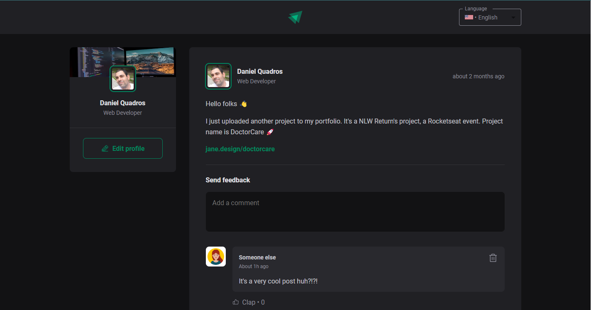
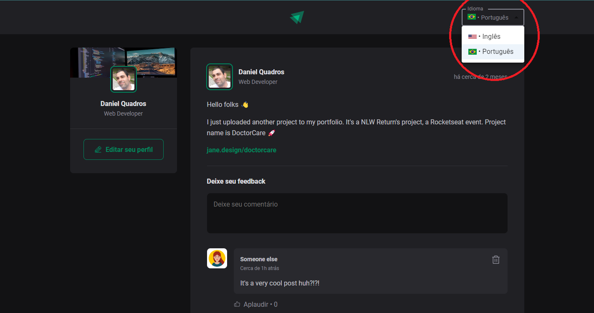
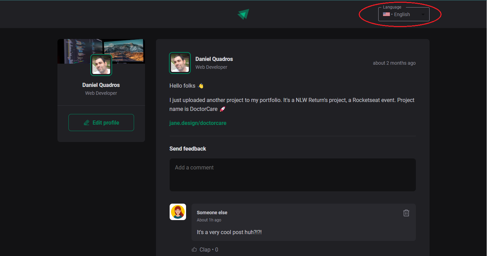

# ENGLISH

# FEED OF POSTS AND COMMENTS

Project 01 of Rocketseat's Ignite course. Excellent project to start the course, as it works with the basic fundamentals of React.
It's always good to review some technologies we've already worked on and have the opportunity to further consolidate the concepts of each one of them.

THE PROJECT:

This project proposes to create a dynamic and responsive page that simulates a social network where the user's profile, posts and post comments appear.
The system also allows adding and removing comments.

------------

# See the model:

Look at the exemple

------------

PERSONAL CONTRIBUTION:

Added functionality to change system languages using the <Select> component of Material UI.
This feature alternates all system texts between Brazilian Portuguese and American English.

!readme-04](src/assets/readme-04.png)

------------

# Technologies:

1. ReactJS + Vite + Typescript

  * Components
  * Properties (props)
  * React Hooks
    - useState
    - useEffect
  * React rendering flow
  * Immutability
  * Styling (modules.css)

# Main dependencies:

    * date-fns 2.29.3
    * phosphor-react 1.4.1
    * @emotion/react ^11.10.5
    * @emotion/styled ^11.10.5
    * @mui/material ^5.10.16

------------

------------

# Português

# FEED DE POSTS E COMENTÁRIOS

Projeto 01 do curso Ignite da Rocketseat. Projeto excelente para iniciar o curso, pois trabalha com os fundamentos básicos do React.
É sempre bom rever algumas tecnologias que já trabalhamos e ter a oportunidade de consolidar ainda mais os conceitos de cada uma delas.

------------

O PROJETO:

Este projeto tem como proposta criar uma página dinâmica e responsiva que simula uma rede social onde aparece o perfil do usuário, os posts e comentários dos posts.
O sistema permite ainda adicionar e remover comentários.

------------

CONTRIBUIÇÃO PESSOAL AO PROJETO:

Adicionado a funcionalidade de alteração de idiomas do sistema utilizando o componente <Select> do Material UI.
Esta funcionalidade alterna todos os textos do sistema entre os idiomas Português do Brasil e o Inglês Americano.

------------

# Tecnologias utilizadas:

1. ReactJS + Vite + Typescript

  * Componentes (Components)
  * Propriedades (props)
  * React Hooks
    - useState
    - useEffect
  * Fluxo de renderização do React
  * Imutabilidade (Immutability)
  * Estilização (modules.css)

# Principais dependências:

  * date-fns 2.29.3
  * phosphor-react 1.4.1
  * @emotion/react ^11.10.5
  * @emotion/styled ^11.10.5
  * @mui/material ^5.10.16
